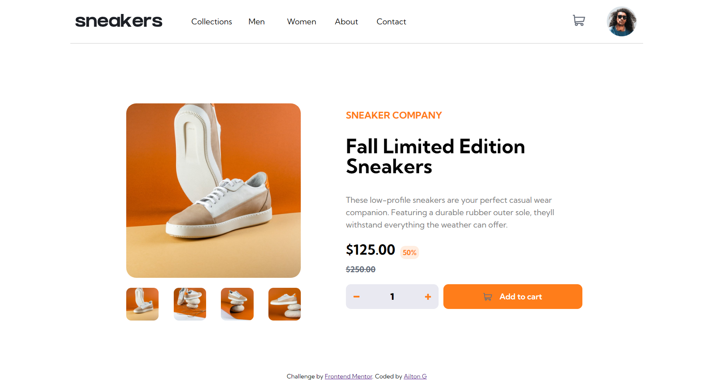

### The challenge

Users should be able to:

- View the optimal layout for the site depending on their device's screen size
- See hover states for all interactive elements on the page
- Open a lightbox gallery by clicking on the large product image
- Switch the large product image by clicking on the small thumbnail images
- Add items to the cart
- View the cart and remove items from it

### Screenshot

### Links

- Solution URL: [solution URL](https://www.frontendmentor.io/solutions/ecommerceproductpagemain-solution-with-html-css-and-javascript-jqQnvY5hKb)
- Live Site URL: [live site](https://ailtong.github.io/Ecommerce-product-page-main/)
